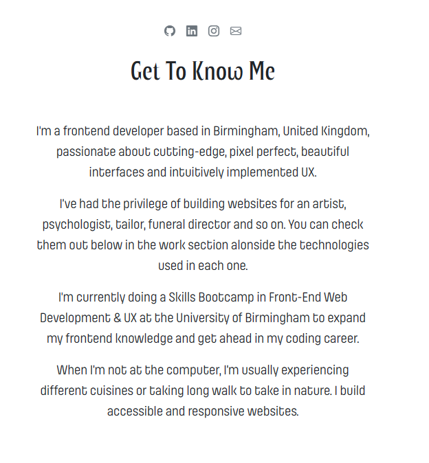
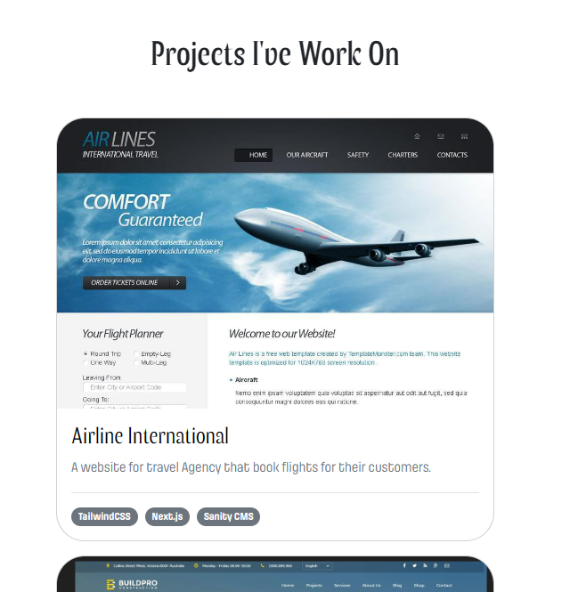
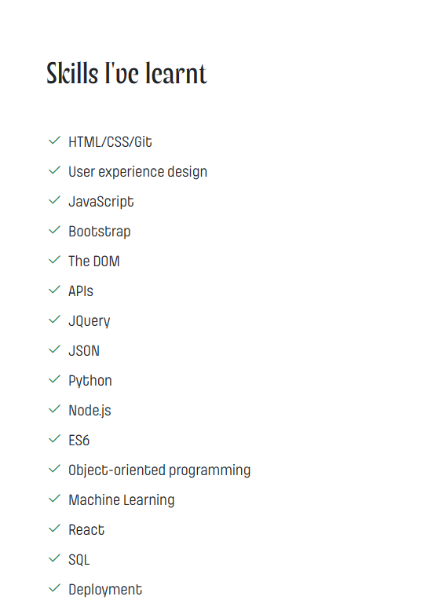

# Maxwell Acha bootstrap-portfolio

## Description
This is a portfolio website built to showcase my skills in frontend web development and UX. The portfolio gives a small introduction about my journey into tech alongside social media links to contact or follow me, some projects I worked on and the technologies I used in each one, and skills I've picked up along the way.

## Links
You can access the website page by clicking on the link below.

GitHub Repository: https://github.com/Maxwella10/bootstrap-portfolio-1.git

Deployed GitHub IO: https://maxwella10.github.io/bootstrap-portfolio-1/

## Credits
The components are inspired by Bootstrap 5 Framework.

## Usage
The portfolio is a static responsive webpage built in HTML, Bootstrap 5 and custom CSS. The pictures below are screenshots of the website displayed on desktop, tablet, and mobile screens.

## To Execute File:

Open in browser

## Features:

HTML Page

Index.html

contains personal bio

